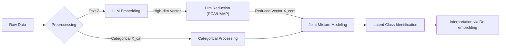

# Interpretable Mixed-type Mixture Modeling (IM3)

## 📌 Overview

This project proposes a novel statistical framework for clustering **mixed-type data** composed of categorical variables (e.g., demographics) and high-dimensional text data. 

Unlike traditional approaches that rely on Bag-of-Words (BoW) and strong independence assumptions (Naive Bayes), this study leverages **Large Language Model (LLM) embeddings** to capture semantic context. To address the "Black-box" nature of embeddings and the "Curse of dimensionality," we introduce a **De-embedding** strategy for model interpretation and a dimensionality reduction step for stable Gaussian Mixture modeling.

## 📖 Motivation

### The Limitation of Existing Methods
Recent studies, such as [Shi et al. (2024)](https://doi.org/10.1214/24-AOAS1893), utilize **Mixture Conditional Regression (MCR)** to estimate extralegal factors in judicial decisions. However, these methods typically model text data $Z$ as a binary vector under a **Naive Bayes assumption**:

$$
P(Z_i | K_i = k) = \prod_{j=1}^{p} P(Z_{ij} | K_i = k)
$$

**Critique:**
1.  **Loss of Semantics:** Binary indicators ignore word order, context, and semantic nuance.
2.  **Unrealistic Assumption:** The independence assumption between words is often violated in natural language.

### Our Approach
We propose replacing the binary feature vector with **dense embeddings** generated by LLMs (e.g., SBERT, OpenAI). This transforms the problem into a **Mixed-type Mixture Model** (Categorical + Continuous). To ensure interpretability and computational feasibility, we integrate dimensionality reduction and a post-hoc "De-embedding" analysis.

## 🛠️ Methodology

The proposed framework consists of three main stages:

### 1. Feature Representation
Let the observed data for subject $i$ be $(\mathbf{x}^{(c)}_i, \mathbf{z}_i)$, where $\mathbf{x}^{(c)}_i$ is the categorical vector (e.g., demographic factors) and $\mathbf{z}_i$ is the raw text data.

* **Text Embedding:** We first transform the raw text into a dense vector using a pre-trained LLM.

$$
\mathbf{v}_i = \text{LLM}(\mathbf{z}_i) \in \mathbb{R}^{D}
$$

*(where $D$ is the original embedding dimension, e.g., 768 or 1536)*

* **Dimensionality Reduction:** To ensure stable covariance estimation in the Gaussian Mixture Model (as $D \gg n$ often leads to singularity issues), we project $\mathbf{v}_i$ to a lower-dimensional manifold $\mathbb{R}^{d}$ (e.g., $d \approx 20 \sim 50$):

$$
\mathbf{x}^{(e)}_i = \phi(\mathbf{v}_i) \in \mathbb{R}^d
$$

Here, $\phi$ denotes a dimensionality reduction function such as **Principal Component Analysis (PCA)**, which preserves the global variance structure suitable for GMM.

### 2. Joint Mixture Model Specification
We assume the population consists of $K$ latent classes. The joint likelihood for the mixed-type data $(\mathbf{x}^{(c)}_i, \mathbf{x}^{(e)}_i)$ is defined as:

$$
\mathcal{L}(\Theta) = \sum_{i=1}^{n} \log \left( \sum_{k=1}^{K} \pi_k \cdot f_{\text{cat}}(\mathbf{x}^{(c)}_i | \boldsymbol{\alpha}_k) \cdot f_{\text{cont}}(\mathbf{x}^{(e)}_i | \boldsymbol{\mu}_k, \boldsymbol{\Sigma}_k) \right)
$$

Where:
* **Mixing Proportion:** $\pi_k$ represents the prior probability of class $k$, satisfying $\sum_{k=1}^K \pi_k = 1$.
* **Categorical Part:** $f_{\text{cat}}$ follows a **Multinomial distribution** parameterized by $\boldsymbol{\alpha}_k$, capturing the distribution of demographic variables within each class.
* **Continuous (Embedding) Part:** $f_{\text{cont}}$ follows a **Multivariate Gaussian distribution**, capturing the semantic clusters of the text:

$$
f_{\text{cont}}(\mathbf{x}^{(e)}_i | \boldsymbol{\mu}_k, \boldsymbol{\Sigma}_k) = (2\pi)^{-d/2}|\boldsymbol{\Sigma}_k|^{-1/2} \exp\left(-\frac{1}{2}(\mathbf{x}^{(e)}_i - \boldsymbol{\mu}_k)^T \boldsymbol{\Sigma}_k^{-1} (\mathbf{x}^{(e)}_i - \boldsymbol{\mu}_k)\right)
$$

### 3. Interpretation Strategy (De-embedding)
A major challenge with embeddings is their lack of interpretability. Since the cluster centroid $\boldsymbol{\mu}_k$ lies in a reduced embedding space, it is "black-box" to human readers. We propose two **"De-embedding"** methods to recover the semantic meaning of each latent class $k$.

#### Method A: Semantic Anchor (Retrieval-based)
We identify **Prototype Documents** from the original dataset that are geometrically closest to the estimated cluster centroid $\boldsymbol{\mu}_k$.

$$
\text{Prototype}_k = \{ \mathbf{z}_j \mid \mathbf{z}_j \in \text{Dataset}, \text{argmax}_{j} \text{CosineSim}(\mathbf{x}^{(e)}_j, \boldsymbol{\mu}_k) \}
$$

* **Usage:** This allows researchers to qualitatively understand the cluster by reading the actual representative texts (e.g., "This cluster represents 'Voice Phishing' cases").

#### Method B: Linear Decoder (Keyword Extraction)
We train a global linear decoder (or Lasso regression) to map the reduced embeddings back to the interpretable Bag-of-Words (BoW) space.

$$
\hat{\mathbf{W}} = \underset{\mathbf{W}}{\text{argmin}} \sum_{i=1}^n || \mathbf{y}_{\text{BoW}, i} - \mathbf{x}^{(e)}_i \mathbf{W} ||_2^2 + \lambda ||\mathbf{W}||_1
$$

Using the estimated weight matrix $\hat{\mathbf{W}}$, we transform the centroid $\boldsymbol{\mu}_k$ into a keyword importance vector $\mathbf{w}_k = \boldsymbol{\mu}_k \hat{\mathbf{W}}$, extracting the top-weighted words for each class.
* **Usage:** This provides a quantitative description (e.g., "Top keywords: *Fraud, Bank, Transfer*").

## 🚀 Key Contributions
1.  **Semantic-Aware Clustering:** Overcomes the limitations of Naive Bayes and binary text representations by utilizing context-rich LLM embeddings.
2.  **Unified Framework:** Provides a rigorous statistical model for jointly analyzing structured demographics and unstructured text data.
3.  **Explainability:** Bridges the gap between "Black-box" neural embeddings and "White-box" statistical inference via the proposed de-embedding strategies.

## 📚 References
* **Primary Reference:** Shi, J., Wang, F., Gao, Y., Song, X., & Wang, H. (2024). *Mixture conditional regression for estimating extralegal factor effects*. The Annals of Applied Statistics, 18(3), 2535-2550.
* **Mixture Models:** Scrucca, L., Fop, M., Murphy, T. B., & Raftery, A. E. (2016). *mclust 5: clustering, classification and density estimation using Gaussian finite mixture models*. The R Journal, 8(1), 289.
* **Embeddings:** Reimers, N., & Gurevych, I. (2019). *Sentence-BERT: Sentence Embeddings using Siamese BERT-Networks*.

---
*Author: Hyunsoo Shin*

*Affiliation: Department of Statistics, Sungkyunkwan University*
