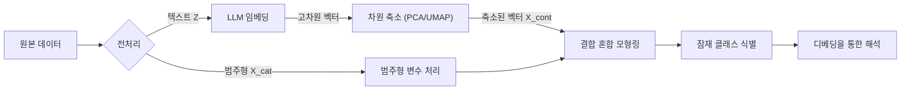

# Interpretable Mixed-type Mixture Modeling

## Overview

본 프로젝트는 범주형 변수(예: 인구통계학적 정보)와 고차원 텍스트 데이터로 구성된 **혼합형 데이터(Mixed-type data)**를 군집화하기 위한 새로운 통계적 프레임워크를 제안합니다.

기존 연구들이 단어 가방 모형(Bag-of-Words, BoW)이나 강력한 독립성 가정(나이브 베이즈)에 의존했던 것과 달리, 본 연구는 **거대 언어 모델(LLM) 임베딩**을 활용하여 텍스트의 의미론적 문맥(Semantic Context)을 포착합니다. 또한, 임베딩의 "블랙박스" 특성과 "차원의 저주" 문제를 해결하기 위해, 모델 해석을 위한 **디베딩(De-embedding)** 전략과 안정적인 가우시안 혼합 모형(GMM) 추정을 위한 차원 축소 단계를 도입했습니다.

## (Motivation

### 기존 방법론의 한계
[Shi et al. (2024)](https://doi.org/10.1214/24-AOAS1893)와 같은 최근 연구에서는 사법적 판결에서 법 외적 요인(Extralegal factors)을 추정하기 위해 **조건부 혼합 회귀(MCR)**를 사용했습니다. 그러나 이러한 방법들은 텍스트 데이터 $Z$를 **나이브 베이즈 가정** 하에 이진(Binary) 벡터로 모델링한다는 한계가 있습니다.

$$
P(Z_i | K_i = k) = \prod_{j=1}^{p} P(Z_{ij} | K_i = k)
$$

**비판점 (Critique):**
1.  **의미 손실 (Loss of Semantics):** 이진 지표(Indicator)는 단어의 순서, 문맥, 그리고 미세한 의미론적 뉘앙스를 무시합니다.
2.  **비현실적 가정 (Unrealistic Assumption):** 자연어에서 단어 간의 독립성 가정은 현실적으로 위배되는 경우가 많습니다.

### 제안하는 접근법 (Our Approach)
우리는 이진 특성 벡터를 LLM(예: SBERT, OpenAI)이 생성한 **밀집 임베딩(Dense Embeddings)**으로 대체할 것을 제안합니다. 이를 통해 문제는 **혼합형 혼합 모형(범주형 + 연속형)**으로 변환됩니다. 해석 가능성과 계산 효율성을 보장하기 위해, 차원 축소 기법과 사후적 "디베딩(De-embedding)" 분석을 통합했습니다.

## Methodology

제안된 프레임워크는 크게 세 가지 단계로 구성됩니다:

### 1. Feature Representation
관측된 대상 $i$의 데이터를 $(\mathbf{x}^{(c)}_i, \mathbf{z}_i)$라고 합시다. 여기서 $\mathbf{x}^{(c)}_i$는 범주형 벡터(예: 인구통계 변수), $\mathbf{z}_i$는 원본 텍스트 데이터입니다.

* **텍스트 임베딩 (Text Embedding):** 먼저 사전 학습된 LLM을 사용하여 원본 텍스트를 밀집 벡터로 변환합니다.

$$
\mathbf{v}_i = \text{LLM}(\mathbf{z}_i) \in \mathbb{R}^{D}
$$

*(여기서 D는 원본 임베딩 차원으로, 예: 768 또는 1536)*

* **차원 축소 (Dimensionality Reduction):** 가우시안 혼합 모형에서 공분산 행렬의 안정적인 추정을 위해(즉, $D \gg n$으로 인한 특이성 문제 방지), $\mathbf{v}_i$를 저차원 매니폴드 $\mathbb{R}^{d}$로 투영합니다 (예: $d \approx 20 \sim 50$).

$$
\mathbf{x}^{(e)}_i = \phi(\mathbf{v}_i) \in \mathbb{R}^d
$$

여기서 $\phi$는 GMM에 적합한 전역적 분산 구조를 보존하는 **주성분 분석(PCA)**과 같은 차원 축소 함수를 의미합니다.

### 2. Joint Mixture Model Specification
전체 모집단이 $K$개의 잠재 클래스(Latent Class)로 구성된다고 가정합니다. 혼합형 데이터 $(\mathbf{x}^{(c)}_i, \mathbf{x}^{(e)}_i)$에 대한 결합 우도(Likelihood)는 다음과 같이 정의됩니다.

$$
\mathcal{L}(\Theta) = \sum_{i=1}^{n} \log \left( \sum_{k=1}^{K} \pi_k \cdot f_{\text{cat}}(\mathbf{x}^{(c)}_i | \boldsymbol{\alpha}_k) \cdot f_{\text{cont}}(\mathbf{x}^{(e)}_i | \boldsymbol{\mu}_k, \boldsymbol{\Sigma}_k) \right)
$$

여기서:
* **혼합 비율 (Mixing Proportion):** $\pi_k$는 클래스 $k$의 사전 확률이며, $\sum_{k=1}^K \pi_k = 1$을 만족합니다.
* **범주형 부분 (Categorical Part):** $f_{\text{cat}}$은 파라미터 $\boldsymbol{\alpha}_k$를 갖는 **다항 분포(Multinomial distribution)**를 따르며, 각 클래스 내 인구통계학적 변수의 분포를 포착합니다.
* **연속형(임베딩) 부분 (Continuous Part):** $f_{\text{cont}}$는 **다변량 정규 분포(Multivariate Gaussian distribution)**를 따르며, 텍스트의 의미론적 군집을 포착합니다.

$$
f_{\text{cont}}(\mathbf{x}^{(e)}_i | \boldsymbol{\mu}_k, \boldsymbol{\Sigma}_k) = (2\pi)^{-d/2}|\boldsymbol{\Sigma}_k|^{-1/2} \exp\left(-\frac{1}{2}(\mathbf{x}^{(e)}_i - \boldsymbol{\mu}_k)^T \boldsymbol{\Sigma}_k^{-1} (\mathbf{x}^{(e)}_i - \boldsymbol{\mu}_k)\right)
$$

### 3. Interpretation via De-embedding
임베딩의 주요 과제는 해석력 부족입니다. 군집의 중심(Centroid) $\boldsymbol{\mu}_k$가 축소된 임베딩 공간에 존재하기 때문에, 사람은 이를 직관적으로 이해할 수 없습니다(Black-box). 우리는 각 잠재 클래스 $k$의 의미를 복원하기 위해 두 가지 **"디베딩(De-embedding)"** 방법을 제안합니다.

#### 방법 A: 의미론적 앵커 (검색 기반)
추정된 군집 중심 $\boldsymbol{\mu}_k$와 기하학적으로 가장 가까운 원본 데이터셋의 **프로토타입 문서(Prototype Documents)**를 식별합니다.

$$
\text{Prototype}_k = \{ \mathbf{z}_j \mid \mathbf{z}_j \in \text{Dataset}, \text{argmax}_{j} \text{CosineSim}(\mathbf{x}^{(e)}_j, \boldsymbol{\mu}_k) \}
$$

* **활용:** 연구자가 실제 대표 텍스트를 읽음으로써 군집을 정성적으로 이해할 수 있게 합니다. (예: "이 군집은 '보이스피싱' 사건들을 대표한다.")

#### 방법 B: 선형 디코더 (키워드 추출)
축소된 임베딩을 다시 해석 가능한 단어 가방(BoW) 공간으로 매핑하는 전역 선형 디코더(또는 Lasso 회귀)를 학습합니다.

$$
\hat{\mathbf{W}} = \underset{\mathbf{W}}{\text{argmin}} \sum_{i=1}^n || \mathbf{y}_{\text{BoW}, i} - \mathbf{x}^{(e)}_i \mathbf{W} ||_2^2 + \lambda ||\mathbf{W}||_1
$$

추정된 가중치 행렬 $\hat{\mathbf{W}}$를 사용하여, 중심 벡터 $\boldsymbol{\mu}_k$를 키워드 중요도 벡터 $\mathbf{w}_k = \boldsymbol{\mu}_k \hat{\mathbf{W}}$로 변환하고, 각 클래스의 상위 가중치 단어를 추출합니다.
* **활용:** 군집에 대한 정량적 설명을 제공합니다. (예: "상위 키워드: *사기, 은행, 송금*")

## Key Contributions
1.  **의미 기반 군집화 (Semantic-Aware Clustering):** 문맥이 풍부한 LLM 임베딩을 활용하여 나이브 베이즈 가정과 이진 텍스트 표현의 한계를 극복했습니다.
2.  **통합 프레임워크 (Unified Framework):** 구조화된 인구통계 데이터와 비정형 텍스트 데이터를 결합하여 분석할 수 있는 엄밀한 통계적 모델을 제공합니다.
3.  **설명 가능성 (Explainability):** 제안된 디베딩 전략을 통해 "블랙박스" 신경망 임베딩과 "화이트박스" 통계적 추론 사이의 간극을 해소했습니다.

## References
* **Primary Reference:** Shi, J., Wang, F., Gao, Y., Song, X., & Wang, H. (2024). *Mixture conditional regression for estimating extralegal factor effects*. The Annals of Applied Statistics, 18(3), 2535-2550.
* **Mixture Models:** Scrucca, L., Fop, M., Murphy, T. B., & Raftery, A. E. (2016). *mclust 5: clustering, classification and density estimation using Gaussian finite mixture models*. The R Journal, 8(1), 289.
* **Embeddings:** Reimers, N., & Gurevych, I. (2019). *Sentence-BERT: Sentence Embeddings using Siamese BERT-Networks*.

---
*Author: Hyunsoo Shin*

*Affiliation: Department of Statistics, Sungkyunkwan University*
