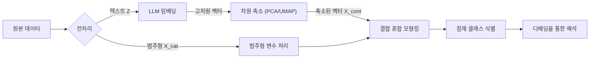

# Interpretable Mixed-type Mixture Modeling

## 1. Overview
본 프로젝트는 범주형 변수(예: 인구통계, 캠페인 속성)와 텍스트(비정형)로부터 얻어지는 고차원 임베딩을 하나의 잠재 클래스(혼합) 모형으로 결합하여 군집화/세그먼테이션을 수행하는 혼합형 데이터(Mixed-type data) 혼합모형 프레임워크를 제안합니다.

기존 연구들이 단어 가방 모형(Bag-of-Words, BoW)이나 강력한 독립성 가정(나이브 베이즈)에 의존했던 것과 달리, 본 연구는 **거대 언어 모델(LLM) 임베딩**을 활용하여 텍스트의 의미론적 문맥(Semantic Context)을 포착합니다. 또한, 임베딩의 "블랙박스" 특성과 "차원의 저주" 문제를 해결하기 위해, 모델 해석을 위한 **디베딩(De-embedding)** 전략과 안정적인 가우시안 혼합 모형(GMM) 추정을 위한 차원 축소 단계를 도입했습니다.
## 2. Motivation

### 기존 방법론의 한계

[Shi et al. (2024)](https://doi.org/10.1214/24-AOAS1893)와 같은 최근 연구에서는 텍스트 $Z$를 이진(또는 BoW) 벡터로 두고, 클래스 $K_i=k$ 조건부에서 나이브 베이즈 형태를 가정합니다.

$$
P(Z_i | K_i = k) = \prod_{j=1}^{p} P(Z_{ij} | K_i = k)
$$

이때 주요 한계는 다음과 같습니다.

1. **의미 손실 (Loss of Semantics):** 단어의 순서, 문맥, 그리고 미세한 의미론적 뉘앙스가 사라짐
    
2. **비현실적 가정 (Unrealistic Assumption):** 자연어에서 단어 간의 독립성 가정은 현실적으로 위배되는 경우가 많습니다.

### 제안하는 접근법 (Our Approach)
우리는 이진 특성 벡터를 LLM(예: SBERT, OpenAI)이 생성한 밀집 임베딩(Dense Embeddings)으로 바꾸면, 문제는 혼합형 혼합 모형(범주형 + 연속형)으로 변환됩니다. 다만 임베딩은 고차원이고 해석이 어려우므로, (차원축소 → 혼합모형 적합 → 디베딩 해석)을 하나의 파이프라인으로 고정합니다.

## 3. Methodology

관측치 $i$는 다음의 mixed-type 정보를 가진다고 둡니다.

- 범주형 블록: $\mathbf{x}^{(c)}_i$ (예: 인구통계, 국가/채널/소재유형)
    
- 텍스트: $\mathbf{z}_i$ (문서/문장/광고 카피)
    
- (선택) 추가 연속형 지표: $\mathbf{y}_i$ (예: CTR, CVR, ROAS 등)

텍스트는 LLM 임베딩과 차원 축소를 거쳐 연속형 특징으로 변환합니다. 제안된 프레임워크는 크게 세 가지 단계로 구성됩니다:

#### 3.1. Feature Representation
관측된 대상 $i$의 데이터를 $(\mathbf{x}^{(c)}_i, \mathbf{z}_i)$라고 합시다. 여기서 $\mathbf{x}^{(c)}_i$는 범주형 벡터(예: 인구통계 변수), $\mathbf{z}_i$는 원본 텍스트 데이터입니다.

* **텍스트 임베딩 (Text Embedding):** 먼저 사전 학습된 LLM을 사용하여 원본 텍스트를 밀집 벡터로 변환합니다.
    

$$\mathbf{v}_i = \text{LLM}(\mathbf{z}_i) \in \mathbb{R}^{D}$$

_(여기서 D는 원본 임베딩 차원으로, 예: 768 또는 1536)_

* **차원 축소 (Dimensionality Reduction):** 가우시안 혼합 모형에서 공분산 행렬의 안정적인 추정을 위해(즉, $D \gg n$으로 인한 특이성 문제 방지), $\mathbf{v}_i$를 저차원 매니폴드 $\mathbb{R}^{d}$로 투영합니다 (예: $d \approx 20 \sim 50$).
    

$$\mathbf{x}^{(e)}_i = \phi(\mathbf{v}_i) \in \mathbb{R}^d$$

여기서 $\phi$는 GMM에 적합한 전역적 분산 구조를 보존하는 **주성분 분석(PCA)**과 같은 차원 축소 함수를 의미합니다.

#### 3.2. Joint Mixture Model Specification

전체 모집단이 $K$개의 잠재 클래스(Latent Class)로 구성된다고 가정합니다. "잠재 클래스가 주어졌을 때 범주형 변수와 연속형 변수는 조건부 독립(Conditionally Independent)"이라고 가정하면, 혼합형 데이터 $(\mathbf{x}^{(c)}_i, \mathbf{x}^{(e)}_i)$에 대한 결합 우도(Likelihood)는 다음과 같이 정의됩니다.

$$\mathcal{L}(\Theta) = \sum_{i=1}^{n} \log \left( \sum_{k=1}^{K} \pi_k \cdot f_{\text{cat}}(\mathbf{x}^{(c)}_i | \boldsymbol{\alpha}_k) \cdot f_{\text{cont}}(\mathbf{x}^{(e)}_i | \boldsymbol{\mu}_k, \boldsymbol{\Sigma}_k) \right)$$

여기서:

- **혼합 비율 (Mixing Proportion):** $\pi_k$는 클래스 $k$의 사전 확률이며, $\sum_{k=1}^K \pi_k = 1$을 만족합니다.
    
- **범주형 부분 (Categorical Part):** $f_{\text{cat}}$은 파라미터 $\boldsymbol{\alpha}_k$를 갖는 항 분포(Multinomial distribution)를 따르며, 각 클래스 내 인구통계학적 변수의 분포를 포착합니다.
    
- **연속형(임베딩) 부분 (Continuous Part):** $f_{\text{cont}}$는 다변량 정규 분포(Multivariate Gaussian distribution)를 따르며, 텍스트의 의미론적 군집을 포착합니다.
    

$$f_{\text{cont}}(\mathbf{x}^{(e)}_i | \boldsymbol{\mu}_k, \boldsymbol{\Sigma}_k) = (2\pi)^{-d/2}|\boldsymbol{\Sigma}_k|^{-1/2} \exp\left(-\frac{1}{2}(\mathbf{x}^{(e)}_i - \boldsymbol{\mu}_k)^T \boldsymbol{\Sigma}_k^{-1} (\mathbf{x}^{(e)}_i - \boldsymbol{\mu}_k)\right)$$

### 4. Interpretation via De-embedding

임베딩의 주요 과제는 해석력 부족입니다. 군집의 중심(Centroid) $\boldsymbol{\mu}_k$가 축소된 임베딩 공간에 존재하기 때문에, 사람은 이를 직관적으로 이해할 수 없습니다(Black-box). 우리는 각 잠재 클래스 $k$의 의미를 복원하기 위해 두 가지 **디베딩(De-embedding)** 방법을 제안합니다.

#### 4.1. 방법 A: 의미론적 앵커 (검색 기반)

추정된 군집 중심 $\boldsymbol{\mu}_k$와 기하학적으로(Latent Space 상에서) 가장 가까운 원본 데이터셋의 프로토타입 문서를 식별합니다. GMM의 기하학적 구조와 일치시키기 위해 **유클리드 거리(또는 마할라노비스 거리)**를 최소화하는 관측치를 선택합니다.

$$\text{Prototype}_k = \{ \mathbf{z}_j \mid \mathbf{z}_j \in \text{Dataset}, \underset{j}{\text{argmin}} || \mathbf{x}^{(e)}_j - \boldsymbol{\mu}_k ||_2 \}$$

#### 4.2. 방법 B: 선형 디코더 (키워드 추출)

축소된 임베딩을 다시 해석 가능한 단어 가방(BoW) 공간으로 매핑하는 전역 선형 디코더(또는 Lasso 회귀)를 학습합니다.

$$\hat{\mathbf{W}} = \underset{\mathbf{W}}{\text{argmin}} \sum_{i=1}^n || \mathbf{y}_{\text{BoW}, i} - \mathbf{x}^{(e)}_i \mathbf{W} ||_2^2 + \lambda ||\mathbf{W}||_1$$

추정된 가중치 행렬 $\hat{\mathbf{W}}$를 사용하여, 중심 벡터 $\boldsymbol{\mu}_k$를 키워드 중요도 벡터 $\mathbf{w}_k = \boldsymbol{\mu}_k \hat{\mathbf{W}}$로 변환하고, 각 클래스의 상위 가중치 단어를 추출합니다.

- **활용:** 군집에 대한 정량적 설명을 제공합니다. (예: "상위 키워드: _사기, 은행, 송금_")
    

## Key Contributions

1. **의미 기반 군집화 (Semantic-Aware Clustering):** 문맥이 풍부한 LLM 임베딩을 활용하여 나이브 베이즈 가정과 이진 텍스트 표현의 한계를 극복했습니다.
    
2. **통합 프레임워크 (Unified Framework):** 구조화된 인구통계 데이터와 비정형 텍스트 데이터를 결합하여 분석할 수 있는 엄밀한 통계적 모델을 제공합니다.
    
3. **설명 가능성 (Explainability):** 제안된 디베딩 전략을 통해 "블랙박스" 신경망 임베딩과 "화이트박스" 통계적 추론 사이의 간극을 해소했습니다.
## 5. References

- **Primary Reference:** Shi, J., Wang, F., Gao, Y., Song, X., & Wang, H. (2024). _Mixture conditional regression for estimating extralegal factor effects_. The Annals of Applied Statistics, 18(3), 2535-2550.
    
- **Mixture Models:** Scrucca, L., Fop, M., Murphy, T. B., & Raftery, A. E. (2016). _mclust 5: clustering, classification and density estimation using Gaussian finite mixture models_. The R Journal, 8(1), 289.
    
- **Embeddings:** Reimers, N., & Gurevych, I. (2019). _Sentence-BERT: Sentence Embeddings using Siamese BERT-Networks_.

# 게임 마케팅 데이터에 방법론 적용 예시

## 1. 가상의 게임 마케팅 데이터 설정

모바일 RPG 게임의 UA(User Acquisition) 캠페인 데이터가 있다고 가정합니다.

- **관측 단위:** `캠페인 × 국가 × 채널` (Creative ID)
    
    - 예: `Facebook_KR_10월1주차`
        
- **주요 변수들**
    
    - **범주형 변수 ($\mathbf{x}^{(c)}$)**
        
        - `Country` : KR / JP / US
            
        - `Channel` : Facebook / Google / TikTok
            
        - `Creative_Type` : Video / Image / Playable
            
    - **텍스트 변수 ($\mathbf{z}$)**
        
        - `Ad_Text` : 비정형 광고 카피
            
            - 예1: “지금 접속하면 전설 장비 100% 지급!”
                
            - 예2: “귀여운 캐릭터와 함께하는 힐링 RPG”
                
    - **(선택) 연속형 지표 ($\mathbf{y}$)** (결과/설명 변수)
        
        - `CTR` (클릭률), `CVR` (설치 전환율), `7d_ROAS` (수익성)
            

**연구/분석 목표:**

> 이 데이터를 바탕으로 잠재 캠페인 유형(유저 세그먼트/마케팅 전략 패턴) 을 찾고,
> 
> 그 잠재범주를 텍스트 임베딩 + 디베딩(debedding) 으로 “해석 가능한 라벨”로 붙이는 것.
---

## 2. 텍스트 임베딩 생성 단계: Feature Representation

### 2.1. LLM 임베딩 적용 ($\mathbf{z}_i \to \mathbf{v}_i$)

각 광고 문구 $\mathbf{z}_i$에 대해 사전 학습된 LLM(예: SBERT)을 사용하여 문맥 정보를 포함하는 고차원 밀집 벡터로 변환합니다.

$$\mathbf{v}_i = \text{SBERT}(\mathbf{z}_i) \in \mathbb{R}^{768}$$

개념적 예시는 다음과 같습니다.

|**Campaign_ID (i)**|**Ad_Text (zi​)**|**Embedding (vi​)**|
|---|---|---|
|1|전설 장비 100% 지급!|$(0.23, -0.11, \dots)$|
|2|귀여운 캐릭터 힐링 RPG|$(0.05, 0.19, \dots)$|
|3|실시간 PvP로 최강자를 증명하라!|$(-0.12, 0.33, \dots)$|

---
### 2.2 차원축소 ($\mathbf{v}_i \to \mathbf{x}^{(e)}_i$)

GMM의 공분산 행렬 추정 안정성을 위해 PCA를 적용하여 768차원 벡터 $\mathbf{v}_i$를 $d=20$ 차원의 벡터 $\mathbf{x}^{(e)}_i$로 축소합니다.

$$\mathbf{x}^{(e)}_i = \text{PCA}(\mathbf{v}_i) \in \mathbb{R}^{20}$$

이제 모델에 입력되는 데이터는 구조화된 **범주형 벡터 $\mathbf{x}^{(c)}_i$**와 **축소된 연속형 임베딩 $\mathbf{x}^{(e)}_i$**의 결합 형태가 됩니다.

### 2.3. PCA 변환 결과 (예시)

- **Input:** $V$: $(N \times 768)$ 임베딩 행렬
    
- **Output:** $\mathbf{x}^{(e)}$: 상위 $d=20$개 주성분 값
    

결과적으로 각 캠페인 $i$는 다음과 같은 20차원 연속형 변수 벡터를 갖게 됩니다.

|**Campaign_ID**|**PC1 (Action)**|**PC2 (Casual)**|**PC3 (Reward)**|**PC4**|**…**|**PC20**|
|---|---|---|---|---|---|---|
|1|1.8|-0.2|1.5|…|…|1.5|
|2|-0.5|1.9|0.1|…|…|1.2|
|3|2.1|-1.0|-0.3|…|…|0.3|

**Researcher Note:**

- **PC1:** 전투/경쟁 어조와 높은 상관관계 → "하드코어 액션"
    
- **PC2:** 힐링/캐주얼 어휘와 연관 → "캐주얼 감성"
    
- **PC3:** 지급/혜택 어휘와 연관 → "보상 프로모션"

---

## 3. Joint Mixture Modeling

### 3.1. 모형 구조 설정

혼합형 데이터(Categorical + Continuous)에 대한 결합 우도(Joint Likelihood)를 최대화하는 $K$개의 잠재 클래스를 추정합니다. 성과 지표($\mathbf{y}$)를 모델링에 포함할 경우, 이는 연속형 부분에 병합되어 처리됩니다.

$$f(\mathbf{x}_i | \Theta) = \sum_{k=1}^{K} \pi_k \underbrace{P(\mathbf{x}^{(c)}_i | \boldsymbol{\alpha}_k)}_{\text{Multinomial}} \underbrace{\phi(\mathbf{x}^{(e)}_i, \mathbf{y}_i | \boldsymbol{\mu}_k, \boldsymbol{\Sigma}_k)}_{\text{Gaussian}}$$

- **Estimation:** EM 알고리즘을 통해 파라미터 $(\pi_k, \boldsymbol{\alpha}_k, \boldsymbol{\mu}_k, \boldsymbol{\Sigma}_k)$를 추정합니다.
    
- **Model Selection:** BIC를 기준으로 최적의 군집 수 $K=3$을 선택했다고 가정합니다.
    

각 잠재범주(클래스) $k$의 분포 특성:

1. **범주형 변수:** Country, Channel, Creative Type의 다항 분포
    
2. **연속형 변수:** 축소된 텍스트 특징(PC) + 성과 지표(CTR, CVR, ROAS)의 다변량 정규 분포
    

즉, "캠페인 속성 + 텍스트 의미 + 성과 패턴"이 유사한 그룹끼리 묶이게 됩니다.

### 3.2. EM 알고리즘 수행 과정

1. **초기화:** K-means 등을 이용해 잠재 클래스 초기값 설정
    
2. **E-step:** 각 관측치 $i$가 클래스 $k$에 속할 사후 확률 $P(C_i=k|\text{data})$ 계산
    
3. **M-step:** 혼합비 $\pi_k$ 및 각 분포의 파라미터(평균, 공분산, 확률) 업데이트
    
4. **반복:** 수렴할 때까지 2-3단계 반복

---
## 4. Interpretation via De-embedding

모델링 결과 얻어진 각 군집의 중심 $\boldsymbol{\mu}_k$ (특히 텍스트 부분)는 해석 불가능한 숫자입니다. 이를 **De-embedding**하여 의미를 부여합니다.

### 4.1. Method A: Semantic Anchor (Prototype Identification)

군집 중심 $\boldsymbol{\mu}_k$와 유클리드 거리상 가장 가까운 실제 광고 카피(Prototype)를 찾아 정성적으로 라벨링합니다.

$$\text{Prototype}_k = \text{argmin}_{j} || \mathbf{x}^{(e)}_j - \boldsymbol{\mu}_k ||_2$$

|**Cluster**|**Closest Ad Text (Prototype)**|**Researcher's Labeling**|
|---|---|---|
|**$k=1$**|"전설 무기 100% 확정 지급! 신규 서버 오픈 기념 이벤트"|$\to$ **보상/혜택 강조 (Reward-Push)**|
|**$k=2$**|"그리웠던 그 시절의 낭만, 동료들과 함께하는 레이드"|$\to$ **향수/커뮤니티 (Nostalgia & Social)**|
|**$k=3$**|"압도적인 그래픽, 4K로 즐기는 리얼한 타격감"|$\to$ **비주얼/스펙 강조 (High-Spec Visual)**|

### 4.2. Method B: Linear Decoder (Keyword Extraction)

축소된 공간($\mathbb{R}^{20}$)에서 다시 단어(BoW) 공간으로 매핑하는 선형 모델(Lasso 등)을 통해, 각 군집을 대표하는 **핵심 키워드**를 추출합니다.

$$\mathbf{w}_k = \boldsymbol{\mu}_k \hat{\mathbf{W}}$$

**[군집별 상위 추출 키워드]**

- **Cluster 1:** `지급`, `무료`, `쿠폰`, `뽑기`, `SSR`
    
- **Cluster 2:** `길드`, `파티`, `추억`, `감성`, `함께`
    
- **Cluster 3:** `엔진`, `그래픽`, `최적화`, `프레임`, `액션`

### 4.3. 결과 종합 및 LLM 요약 (Synthesis)

Method A/B의 텍스트 해석과 모델의 다른 변수(범주형 $\mathbf{x}^{(c)}$, 성과 $\mathbf{y}$) 분포를 결합하여 최종 프로파일을 작성합니다.

- **Cluster 1 종합:** [키워드: 보상] + [국가: KR] + [매체: Facebook] + [성과: High CVR]
    
- **Cluster 3 종합:** [키워드: 그래픽] + [국가: US] + [매체: TikTok] + [성과: High ROAS]
    

**[LLM을 이용한 최종 요약 프롬프트 예시]**

> "Cluster 1은 '지급, 무료, 쿠폰' 키워드가 특징이며, 한국 시장에서 높은 전환율을 보입니다. 이 군집의 마케팅 전략을 한 문장으로 요약해 주세요."

---
## 5. 최종 결과 요약 및 활용

수치 기반 특성과 LLM 기반 자연어 설명을 결합하여, 실무자가 직관적으로 이해할 수 있는 레이블을 부여합니다.

| **Class** | **레이블 (Naming)**  | **상세 설명 (Summary)**                                                                  |
| --------- | ----------------- | ------------------------------------------------------------------------------------ |
| **1**     | **보상형 하드코어 프로모션** | 강한 전투·보상 메시지(`지급`, `쿠폰`), **KR** 중심, Video/Facebook, **CVR**이 높아 단기 모객에 적합함.         |
| **2**     | **캐주얼 감성 브랜딩**    | 귀여운/힐링 컨셉(`추억`, `감성`), **JP**·Image 비중 높음, 성과는 낮으나 리텐션 유지용 브랜딩에 적합함.                 |
| **3**     | **글로벌 체험형 퍼포먼스**  | Playable/TikTok 중심, 그래픽·액션(`4K`, `Action`) 강조, **US** 비중 높고 **ROAS**가 매우 우수한 고효율 유형. |
### 활용 시나리오

1. **예산 배분 최적화:** ROAS가 가장 높은 **Class 3** (글로벌 퍼포먼스) 군집에 마케팅 예산을 우선 배정.
    
2. **크리에이티브 가이드:** 신규 소재 제작 시, 타겟 국가가 미국(US)이라면 Class 3의 키워드(`Action`, `Graphic`)를 포함하도록 가이드라인 제공.
    
3. **사전 성과 예측:** 제작된 카피를 모델에 입력하여 어느 군집에 속할지 분류하고, 예상되는 성과(ROAS 등)를 런칭 전에 점검.

---
## 6. 전체 흐름 요약

본 예시에서의 전체 분석 파이프라인은 다음과 같습니다.

1. **Data:** 범주형(국가/매체), 텍스트(광고카피), 연속형(성과지표) 데이터 준비
    
2. **Representation:** LLM을 이용한 텍스트 임베딩($\mathbf{v}$) 및 PCA 차원축소($\mathbf{x}^{(e)}$)
    
3. **Modeling:** 범주형-연속형 변수를 결합한 **Joint Mixture Model** 적합
    
4. **De-embedding:** **Method A(Anchor)** & **Method B(Decoder)**로 잠재 공간의 의미 복원
    
5. **Insight:** 통계적 군집을 "해석 가능한 마케팅 전략"으로 변환하여 의사결정에 활용

 
---
*Author: Hyunsoo Shin*

*Affiliation: Department of Statistics, Sungkyunkwan University*
