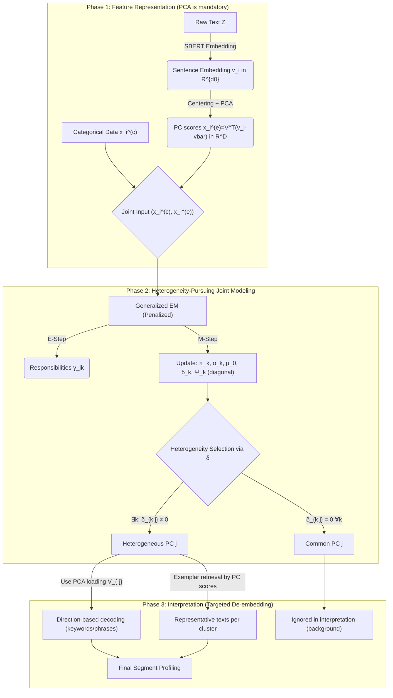

## 1. Overview

본 프로젝트는 범주형 변수(예: 인구통계, 캠페인 속성)와 텍스트(비정형)로부터 얻어지는 고차원 임베딩을 결합하여, 설명 가능한 군집화(Interpretable Clustering)를 수행하는 통계적 프레임워크를 제안한다.

기존의 임베딩 기반 군집화는 (i) 임베딩의 모든 차원이 군집 형성에 관여하여 사후 해석이 불가능하고, (ii) 고차원에서 공분산 추정/최적화가 불안정해지는 문제가 있다. 본 연구는 이질성 탐색(Heterogeneity Pursuit)을 혼합모형 내부의 벌점화 추정(penalized estimation)으로 구현하여, 군집을 구분하는 핵심 의미 차원(Heterogeneous Feature)과 모든 군집이 공유하는 공통 차원(Common Feature)을 통계적으로 분리한다.

특히 본 연구에서는 PCA를 반드시 포함한다. 이유는 (a) 고차원 임베딩을 선형 구조로 요약하여 추정을 안정화하고, (b) PCA 로딩 행렬 $\mathbf{V}$를 통해 Targeted De-embedding(“이 PC는 어떤 단어/구문 방향과 정렬되는가?”)을 수식적으로 정의할 수 있기 때문이다.

---

## 2. Motivation

### 2.1 기존 방법론의 한계

1. BoW/Naive Bayes 기반 텍스트 모형의 한계 단어 빈도 기반 표현은 문맥(Context)과 의미론적 뉘앙스를 충분히 반영하지 못하며, 고차원 희소 벡터에서의 독립성 가정이 강하게 요구된다.
    
2. Embedding + GMM의 한계 SBERT/LLM 임베딩을 그대로 GMM에 적용하면, 수백 차원이 동시에 군집 형성에 관여해 해석이 사실상 불가능하며, 차원의 저주로 인해 공분산 추정이 불안정하고 EM이 특이행렬/로컬 최적점에 민감해진다.
    

### 2.2 제안하는 접근(Our Approach)

본 연구는 다음 두 축을 결합한 통합 프레임워크를 제안한다.

- PCA(선형 차원축소): 고차원 임베딩을 선형 구조(PC)로 압축하여 추정 안정성을 확보하고, PC 로딩 $\mathbf{V}$를 통해 디코딩(semantic direction decoding)을 가능하게 한다.
    
- Heterogeneity Pursuit(벌점화 혼합모형): 평균을 $\mu_k = \mu_0 + \delta_k$로 분해하고 $\delta$에 벌점을 부여하여, 군집 간 평균 차이가 없는 PC를 0으로 수축시키고(공통 차원), 실제로 군집을 가르는 PC만 선택(이질 차원)한다.
    

---

## 3. Methodology: Heterogeneity-Pursuing Joint Mixture Model (PCA + Diagonal $\Sigma_k$)

관측치 $i$는 범주형 데이터 $\mathbf{x}^{(c)}_i$와 텍스트 $\mathbf{z}_i$로 구성된다. 제안 프레임워크는 표현(Representation)–모형 적합(Modeling)–해석(Interpretation)의 3단계로 구성된다.

### 3.1 Feature Representation (PCA-based; formal definition)

SBERT Embedding 각 텍스트 $\mathbf{z}_i$를 SBERT 등으로 임베딩하여 $\mathbf{v}_i \in \mathbb{R}^{d_0}$ (예: $d_0=768$)을 얻는다.

Centering + PCA (mandatory) 전체 평균 $\bar{\mathbf{v}} = \frac{1}{n} \sum_{i=1}^n \mathbf{v}_i$로 중심화한 후 PCA를 수행한다. 로딩 행렬을 $\mathbf{V} \in \mathbb{R}^{d_0 \times D}$로 두고 $\mathbf{V}^\top \mathbf{V} = \mathbf{I}_D$ (orthonormal)로 정규화한다.

$$\mathbf{x}_i^{(e)} = \mathbf{V}^\top (\mathbf{v}_i - \bar{\mathbf{v}}) \in \mathbb{R}^D$$

여기서 $\mathbf{V}_{\cdot j}$는 “PC $j$의 의미 방향(semantic direction)”으로 해석되며, 이후 Targeted De-embedding의 핵심 객체가 된다.

### 3.2 Model Specification (Joint mixture with diagonal covariance)

잠재 클래스 $z_i \in {1, \dots, K}$를 도입하여 결합 밀도를 다음과 같이 정의한다.

$$f(\mathbf{x}_i | \Theta) = \sum_{k=1}^K \pi_k f_{\text{cat}}(\mathbf{x}_i^{(c)} | \boldsymbol{\alpha}_k) f_{\text{cont}}(\mathbf{x}_i^{(e)} | \boldsymbol{\mu}_k, \boldsymbol{\Sigma}_k)$$

(a) Categorical part: LCA-style (conditional independence) 범주형 변수를 $m=1, \dots, M$로 두고, 각 변수의 범주를 $r=1, \dots, R_m$라 하면:

$$f_{\text{cat}}(\mathbf{x}_i^{(c)} | \boldsymbol{\alpha}_k) = \prod_{m=1}^M \prod_{r=1}^{R_m} (\alpha_{kmr})^{I(x_{im}=r)}$$

(b) Continuous part: Penalized Gaussian mixture in PCA space 연속형(PCA score) 부분은 군집별 평균과 군집별 대각 공분산을 갖는 정규분포로 둔다.

$$\mathbf{x}_i^{(e)} | z_i = k \sim N(\boldsymbol{\mu}_k, \boldsymbol{\Sigma}_k), \quad \boldsymbol{\Sigma}_k = \boldsymbol{\Psi}_k = \text{diag}(\sigma_{k1}^2, \dots, \sigma_{kD}^2)$$

핵심 아이디어는 평균을 공통+편차로 분해하는 것이다.

$$\boldsymbol{\mu}_k = \boldsymbol{\mu}_0 + \boldsymbol{\delta}_k$$

식별을 위해 본 연구는 다음 제약을 권장한다(혼합 가중치 기반 식별).

$$\sum_{k=1}^K \pi_k \boldsymbol{\delta}_k = \mathbf{0}$$

- $\boldsymbol{\mu}_0$: mixture-weighted overall mean (Common Mean)
    
- $\boldsymbol{\delta}_k$: 군집 $k$의 평균 편차(Cluster-specific deviation). $\delta_{kj} \neq 0$인 PC 좌표 $j$가 이질성의 원인(heterogeneous feature)이 된다.
    

### 3.3 Penalized Estimation via Generalized EM

불필요한 차원의 편차를 0으로 수축시키기 위해, $\boldsymbol{\delta}$에 Adaptive Lasso 벌점을 부여한다.

$$\max_{\Theta} \{ \sum_{i=1}^n \log f(\mathbf{x}_i | \Theta) - n\lambda \sum_{j=1}^D \sum_{k=1}^K w_{jk} |\delta_{kj}| \}$$

- $w_{jk}$: adaptive weight ($w_{jk} = 1/(|\tilde{\delta}_{kj}| + \epsilon)^\nu$)
    
- $\lambda$: sparsity strength
    

(1) E-step: responsibilities

$$\gamma_{ik} = \frac{\pi_k f_{\text{cat}}(\mathbf{x}_i^{(c)} | \boldsymbol{\alpha}_k) \phi(\mathbf{x}_i^{(e)}; \boldsymbol{\mu}_0 + \boldsymbol{\delta}_k, \boldsymbol{\Psi}_k)}{\sum_{\ell=1}^K \pi_\ell f_{\text{cat}}(\mathbf{x}_i^{(c)} | \boldsymbol{\alpha}_\ell) \phi(\mathbf{x}_i^{(e)}; \boldsymbol{\mu}_0 + \boldsymbol{\delta}_\ell, \boldsymbol{\Psi}_\ell)}$$

(2) M-step: closed-form pieces

- Mixing proportions: $\pi_k \leftarrow \frac{1}{n} \sum_{i=1}^n \gamma_{ik}$
    
- Categorical parameters: $\alpha_{kmr} \leftarrow \frac{\sum_{i=1}^n \gamma_{ik} I(x_{im}=r)}{\sum_{i=1}^n \gamma_{ik}}$
    
- Continuous parameters (Coordinate-wise updates):
    
    - $N_k = \sum_{i=1}^n \gamma_{ik}$, $\bar{x}_{kj} = \frac{1}{N_k}\sum_{i=1}^n\gamma_{ik} x_{ij}^{(e)}$
        
    - (a) Update $\delta_{kj}$ (Soft-thresholding):
        
        $$\delta_{kj} \leftarrow S\left( \bar{x}_{kj} - \mu_{0j}, \frac{n\lambda w_{jk} \sigma_{kj}^2}{N_k} \right),$$
        $$S(a, \tau) = \text{sign}(a)\max(|a|-\tau, 0)$$
        
    - (b) Update $\mu_{0j}$: $$\mu_{0j} \leftarrow \sum_{k=1}^K \pi_k (\bar{x}_{kj} - \delta_{kj})$$
        
    - (c) Update $\sigma_{kj}^2$: $$\sigma_{kj}^2 \leftarrow \frac{1}{N_k} \sum_{i=1}^n \gamma_{ik} (x_{ij}^{(e)} - \mu_{0j} - \delta_{kj})^2$$ (수치 안정성을 위해 $\sigma_{\min}^2$ floor 적용)
        

---

## 4. Interpretation via Targeted De-embedding

### 4.1 Identification of common vs heterogeneous PCs

- Common PC $j$: $\delta_{1j} = \dots = \delta_{Kj} = 0$. 군집 구분에 기여하지 않는 배경 차원.
    
- Heterogeneous PC $j$: $\exists k$ s.t. $\delta_{kj} \neq 0$. 군집을 가르는 핵심 의미 차원.
    

### 4.2 Targeted De-embedding: Direction-based decoding

- Dictionary projection: 후보 표현 집합 $\mathcal{T}$의 각 $t$에 대해 SBERT 임베딩 $\mathbf{e}(t)$ 생성.
    
    $$s_j(t) = \mathbf{V}_{\cdot j}^\top (\mathbf{e}(t) - \bar{\mathbf{v}})$$
    
- Cluster-level profiling: - $\delta_{kj} > 0$: 군집 $k$는 PC $j$의 $+$방향 키워드들과 정렬.
    
    - $\delta_{kj} < 0$: 군집 $k$는 PC $j$의 $-$방향 키워드들과 정렬.
        

### 4.3 Exemplar retrieval

- PC score $x_{ij}^{(e)}$를 이용하여 각 군집에서 해당 PC를 잘 대변하는 상위 $\rho\%$ 텍스트 추출 및 제시.
    

---

## 5. Simulation Study Plan

1. DGP: PCA score space에서 $D$개 차원 중 $q$개만 $\delta \neq 0$으로 생성. 필요 시 원공간 임베딩 $\mathbf{v}_i = \bar{\mathbf{v}} + \mathbf{V}\mathbf{x}_i^{(e)} + \epsilon_i$로 확장.
    
2. Comparison Models: Standard GMM, Two-step PCA+GMM, Proposed Model.
    
3. Metrics: TPR/FPR (Selection consistency), ARI (Clustering accuracy), Jaccard similarity (Stability).

## 6. Case Study: 게임 마케팅 데이터 적용 예시

### 6.1 예상 산출물: Heterogeneity table

|PC|δ^1 (Cluster A)|δ^2 (Cluster B)|δ^3 (Cluster C)|Decision|
|---|---|---|---|---|
|PC 1|+2.5|-1.2|-1.3|Heterogeneous|
|PC 3|-0.8|-0.2|+1.0|Heterogeneous|
|PC 4|0.0|0.0|0.0|Common|
### 6.2 Updated profiling

- PC 1: “보상/쿠폰/지급” 정렬. Cluster A ($\delta_{A1} > 0$) $\rightarrow$ 보상 지향 세그먼트.
    
- PC 3: “그래픽/타격감” 정렬. Cluster C ($\delta_{C3} > 0$) $\rightarrow$ 비주얼/액션 지향.
    

---

## 7. Conclusion & Contribution

1. Penalized likelihood 기반 이질성 탐색: 비지도 군집화에서 통계적 변수 선택 구현.
    
2. 추정 안정성 확보: PCA + diagonal covariance 제약을 통해 고차원 수치 문제 해결.
    
3. Targeted De-embedding: PCA 로딩 기반 수식적 디코딩으로 XAI 성능 강화.
    
4. 실무 적용: 게임 마케팅 데이터의 실행 가능한 세그먼트 프로파일링 제공.
    

Extension: Group penalty ($\lambda \sum_j w_j \|\boldsymbol{\delta}_{j \cdot}\|_2$)를 통한 PC 단위 직접 선택 및 MFA 확장.
